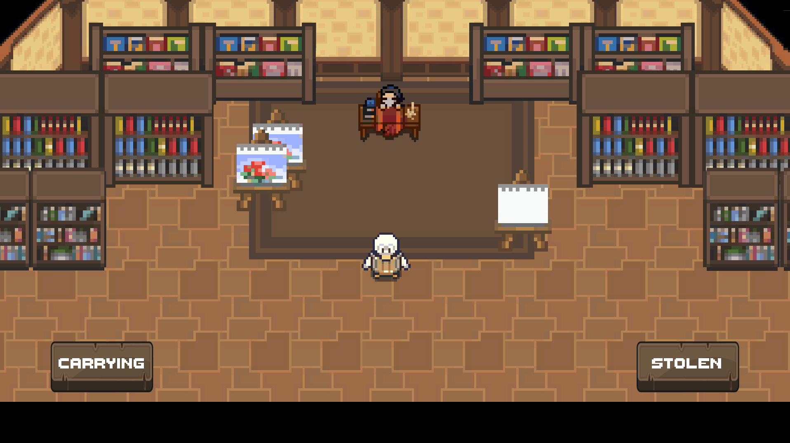
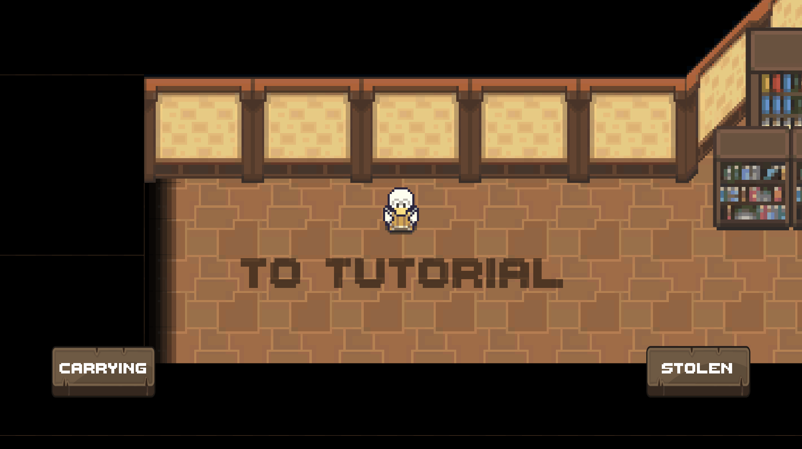
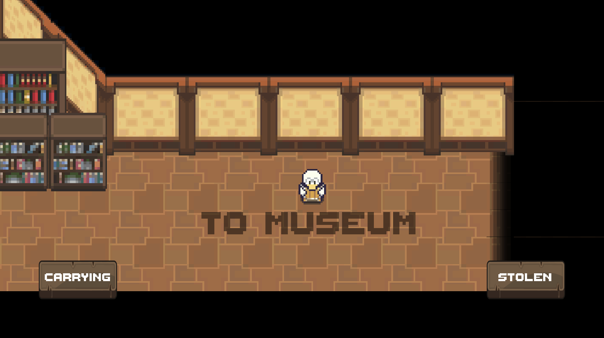
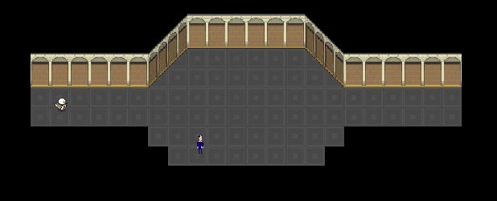
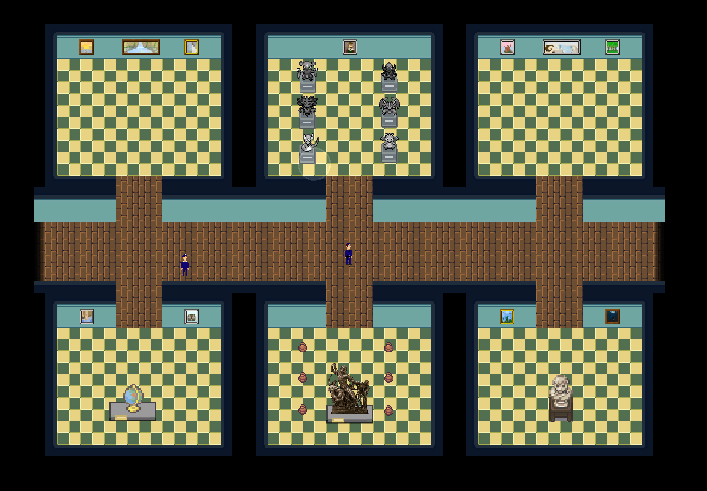
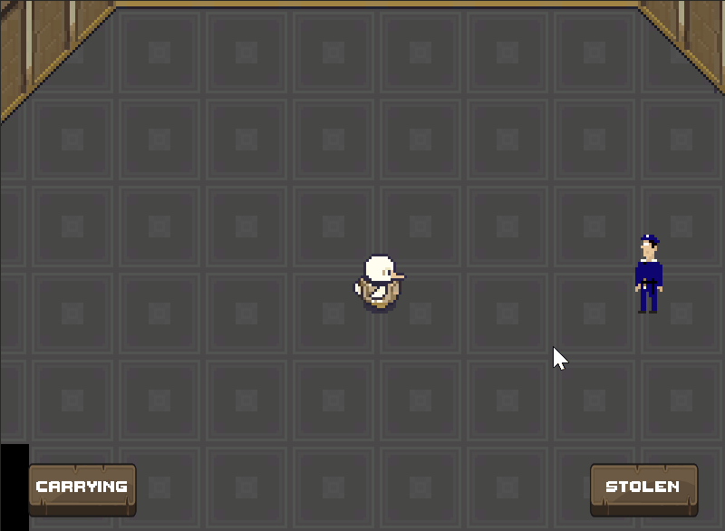
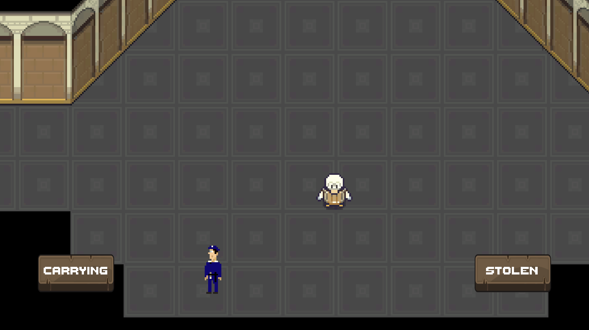
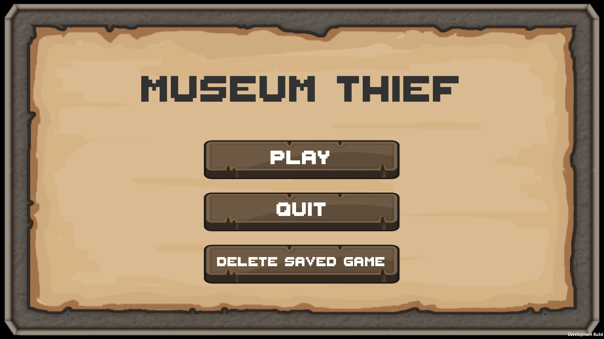

# MuseumThief

Museum thief is a game in which your final goal is to steal the most precious item of the museum, **The BIG GEM**, which belonged to your family and was stolen from it years ago. 

To be able to steal **The BIG GEM**, you'll need to climb all the floors in the museum while stealing other masterpieces from it so you can exchange them from money and buy different *items* that will make your climb easier.

## The Studio
<picture>

</picture>

Starting in the **Studio**, you'll find the *Black Market Merchant*, which will help you sell your masterpieces and also will offer you *items* so your exploration in the museum is easier or to upgrade your stealing capabilities.

Also in the studio you'll find two exits, one for the **Tutorial** and one for the **Museum**. When you start the game a message will pop up advicing the player to go through the tutorial, which will show easily and quick how the game works. 

### Tutorial
<picture>

</picture>

### Museum
<picture>

</picture>

On the museum you'll find different floors, which as you get higher gets more secured and harder to explore. In each of these floor you'll find *Masterpieces* which you can steal, and if you're not caught in the process you'll be able to trade them in the black market for money.

#### Floor 0 - Security Room
<picture>

</picture>

#### Floor 1 - Entrance
<picture>

</picture>

## Guards

On game you'll encounter with two types of guards: *Static Guards* which will stay on the same place and guard certain area and *Patrolling Guards* which will be walking through certain defined points. Both guards will chase you if you get close to them, while *Static Guards* are easier to evade since they won't chase you long enough, *Patrolling Guards* are more athletic and will chase you longer, so be aware!

#### Static Gaurds
<picture>

</picture>

#### Patrolling Gaurds
<picture>

</picture>

## Menus

On game you'll have two menus, the **Main Menu** which appears when you launch the game and also the **Pause Menu**, which will freeze time in game and will give you the option of resuming your game or going back to the main menu (all *masterpieces* in the *carrying* inventory will be lost).

#### Main Menu
<picture>

</picture>
