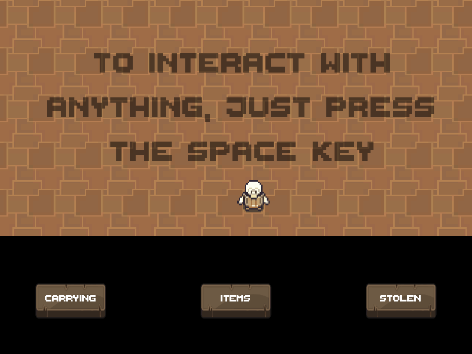
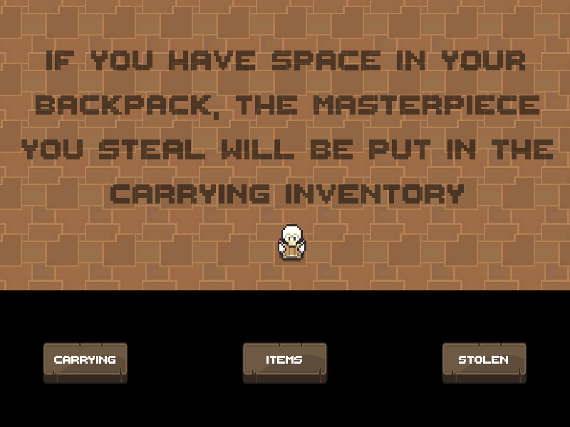
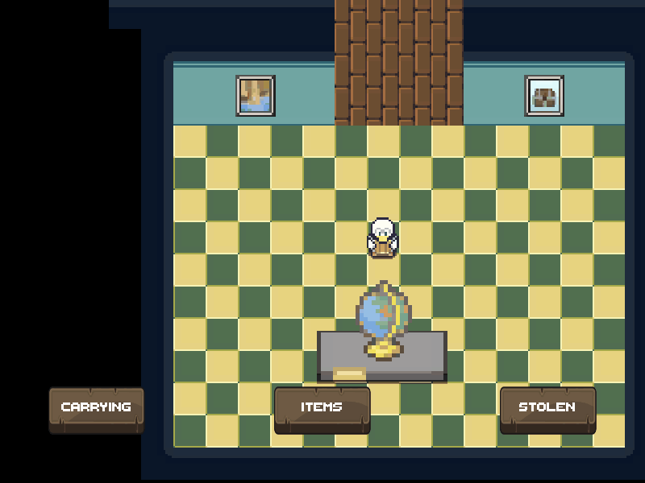
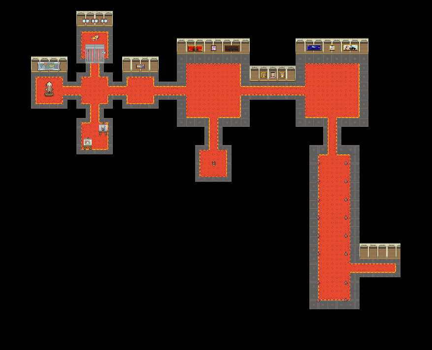
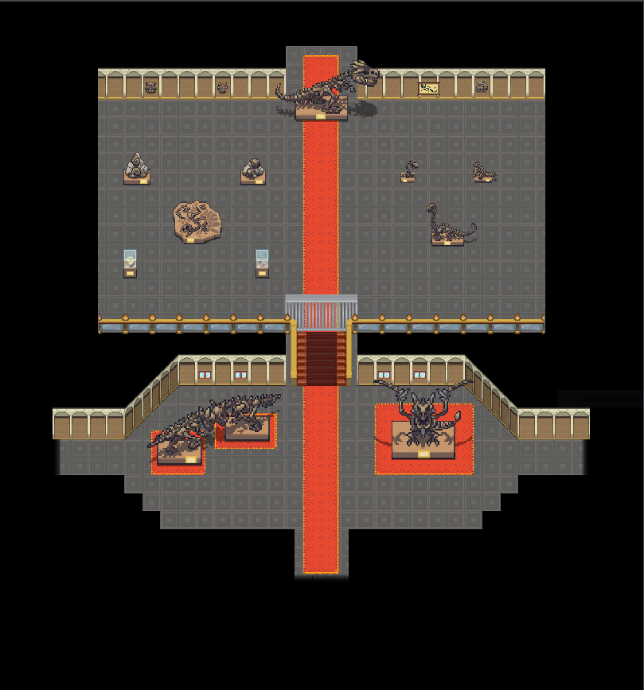
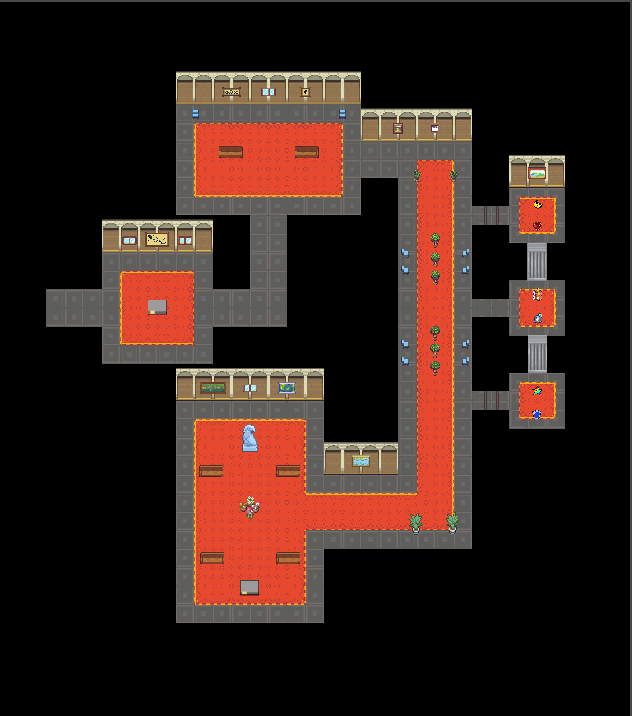
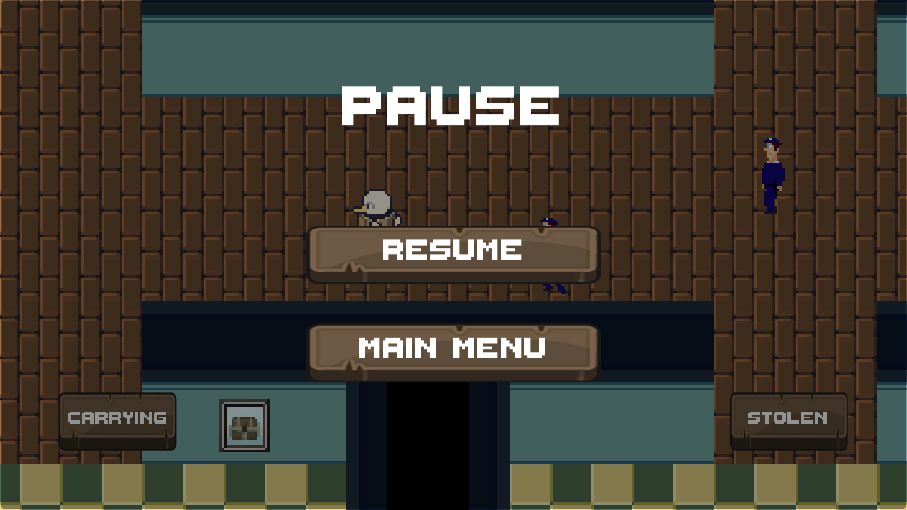

# MuseumThief

Museum thief is a game in which your final goal is to steal the most precious item of the museum, **The DUCK GEM**, which belonged to your family and was stolen from it years ago. 

To be able to steal **The DUCK GEM**, you'll need to climb all the floors in the museum while stealing other masterpieces from it so you can exchange them from money and buy different *items* that will make your climb easier.

All art used in this project is not mine, so special thanks to the following artists:
- [The Quacken](https://deadmadman.itch.io/the-quaken-assets)
- [Princess Phoenix](https://www.deviantart.com/princess-phoenix)
- [Aveon Trainer](https://www.deviantart.com/aveontrainer)
- [Black Hammer (Game UI)](https://assetstore.unity.com/publishers/32893)
- [Hishimy](https://www.deviantart.com/hishimy)
- [That Hime Kun](https://www.deviantart.com/that-hime-kun)
- [Macrovector](https://www.freepik.com/free-vector/fitness-drink-bottles-sport-nutrition-protein-containers-packages-black-white-realistic-dark-transparent-set-isolated_6801359.htm#query=protein&position=43&from_view=search)
- [Kjpargeter](https://www.freepik.com/free-photo/radial-arm-saw-design_870250.htm#query=3d%20illustration%20saw&position=49&from_view=search)

## The Studio
<picture>

</picture>

Starting in the **Studio**, you'll find the *Black Market Merchant*, which will help you sell your masterpieces and also will offer you *items* so your exploration in the museum is easier or to upgrade your stealing capabilities.

Also in the studio you'll find two exits, one for the **Tutorial** and one for the **Museum**. When you start the game a message will pop up advicing the player to go through the tutorial, which will show easily and quick how the game works. 

### Tutorial
<picture>

</picture>

In the tutorial you'll learn the basics of the game, for example, how to interact with objects, what happens when you steal new masterpieces and so on.

#### Interacting with objects

To interact with new objects, just press the space key.

<picture>

</picture>

#### Stealing masterpieces

When stealing masterpieces, the inventories come to play. If you have available space in your carrying backpack, you will just add those items to the carrying inventory, if not, you can carry them on your shoulders, but be aware that it'll make it move slower the heavier the masterpiece.

##### When you have space in your backpack
<picture>

</picture>

##### When you don't have space in your backpack
<picture>

</picture>

The most important thing about stealing masterpieces, is that you'll only really steal them if you manage to get back to the studio, when doing that, all the items you had in your carrying backpack will be put into the stolen backpack (which will work as a record of all the stolen masterpieces) and you will be granted money depending on each stolen masterpiece.

<picture>

</picture>

### Museum
<picture>

</picture>

On the museum you'll find different floors, which as you get higher gets more secured and harder to explore. In each of these floor you'll find *Masterpieces* which you can steal, and if you're not caught in the process you'll be able to trade them in the black market for money.

#### Floor 0 - Security Room
<picture>

</picture>

#### Floor 1 - Entrance
<picture>

</picture>

#### Floor 2 - Fossils and Masterpieces

    <picture>
    
    </picture>
    <picture>
    
    </picture>
    <picture>
    
    </picture>

## Guards

On game you'll encounter with two types of guards: *Static Guards* which will stay on the same place and guard certain area and *Patrolling Guards* which will be walking through certain defined points. Both guards will chase you if you get close to them, while *Static Guards* are easier to evade since they won't chase you long enough, *Patrolling Guards* are more athletic and will chase you longer, so be aware!

Any masterpiece you have in your carrying inventory will be taken by the guards if you get caught, so to be able to steal a masterpiece you'll have to evade all guards on your way back to the Studio room.

#### Static Gaurds
<picture>

</picture>

#### Patrolling Gaurds
<picture>

</picture>

## Menus

On game you'll have two menus, the **Main Menu** which appears when you launch the game and also the **Pause Menu**, which will freeze time in game and will give you the option of resuming your game or going back to the main menu (all *masterpieces* in the *carrying* inventory will be lost).

#### Main Menu
<picture>

</picture>

#### Pause Menu
<picture>

</picture>
